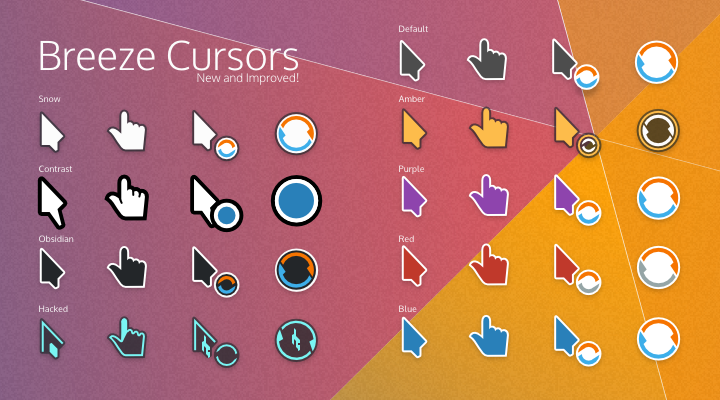

Temas para cursores
================================

Breeze
---------------------------------------

Atualize os repositórios

`sudo apt update`

Instale o tema de cursores

`sudo apt install -y breeze-cursor-theme`

Oxygen
---------------------------------------

Atualize os repositórios

`sudo apt update`

Instale o tema de cursores

`sudo apt install -y oxygen-cursor-theme`

Fonte
------------------------------------------

* [https://installati.one/install-oxygen-cursor-theme-ubuntu-20-04/?expand_article=1](https://installati.one/install-oxygen-cursor-theme-ubuntu-20-04/?expand_article=1)
